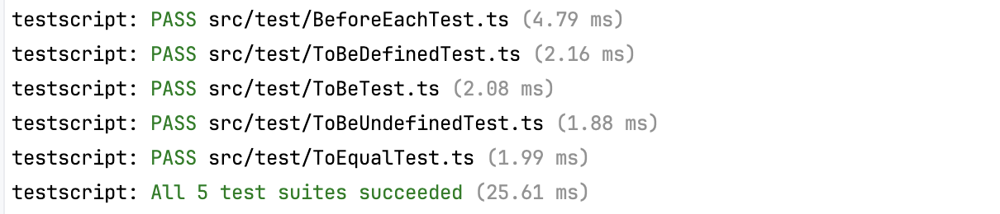
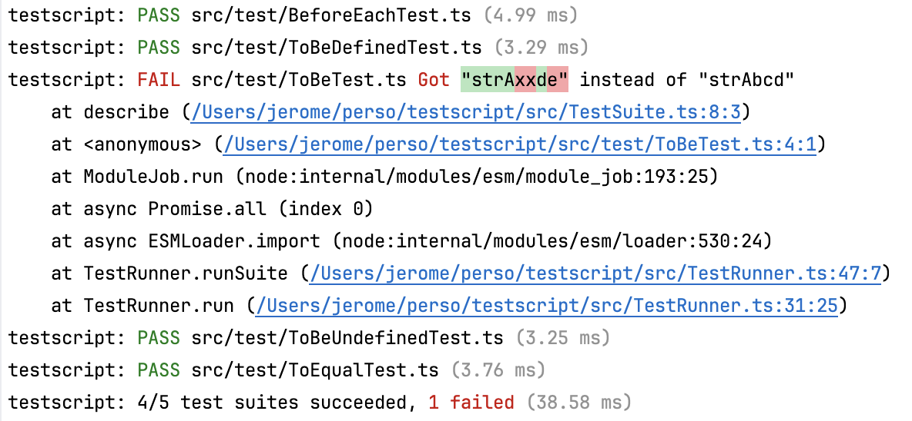

# testscript

Fed up of the difficulty to run tests in this messy world of Node + common JS + ESM + Babel + Jest + TypeScript (or [JavaScript](https://www.npmjs.com/package/@javarome/testscript-js))?
You just want to run your tests of your code, period? The alternative here is as follows:

- Run all TypeScript stuff using [`tsx`](https://github.com/esbuild-kit/tsx) as a drop-in replacement for the `node` command. It just works with TypeScript, and it's fast.
- *A test is an executable*: you don't need a test runner to run a single test file. Instead, just execute the test file:
  ```
  tsx src/My.test.ts
  ````
  Thanks to the `assert()` predicates, this will throw a `TestError` if the test doesn't pass
  (this can also work with a `tsx` alternative as well, but `tsx` makes it easier).
- Keep syntax as similar as possible to the syntax used by [Jest](https://jestjs.io) (`describe()`, `test()`, `expect()`, `beforeEach()`...) , which is the most popular framework to test JS/TS.

```ts
// MyTest.ts
import { describe, expect, test } from '@javarome/testscript';

describe("Some software item", () => {

  test("does something", async () => {
    const item = new SoftwareItem('item1')
    expect(item.name).toBe("item1")
    expect(item.name).not.toBe("item2")
  })
})
```

- The only remaining thing you need is a [`TestRunner`](https://github.com/Javarome/testscript/blob/main/src/TestRunner.ts) to locate tests and execute them at once.
  One can be run using this command:

```
testscript
````

(make sureto install `tsx` before)

This will output:

And an error will output as:



Of course this is typically what you want to run for your `test` npm script.

By default it will look for all `*.test.ts` files in all subdirs, but you can specifiy a different file pattern, like:

```
testscript **/*.spec.ts
````
By default `node_modules` are ignored. You can also customize those excluded paths by specifying a second argument, which can be an array of paths:
```
testscript **/*.test.ts '{out/**,node_modules/**/*.*}'
```

## Debugging

Once you have your test scripts ready in your `package.json`, like below:

````json
{
  "scripts": {
    "test": "testscript",
    "test-one": "tsx src/test/MyTest.ts"
  }
}
````

All you need to need all or one test is to set your breakpoints in your tests 
and run those scripts in debug mode.

Also note that the `TestRunner` uses a `DefaultLogger` instance as a `Logger`, which can be specified as its third constructor argument.
